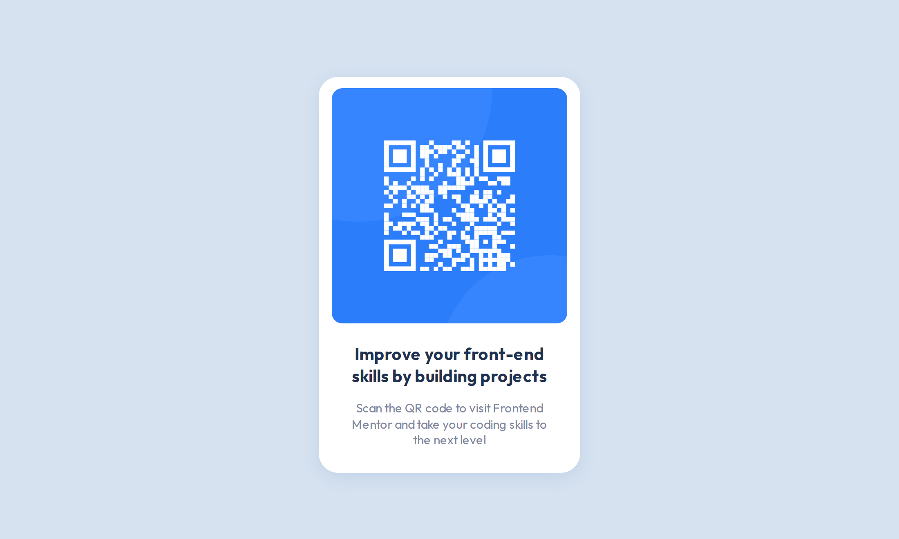

# Frontend Mentor - QR code component solution

This is a solution to the [QR code component challenge on Frontend Mentor](https://www.frontendmentor.io/challenges/qr-code-component-iux_sIO_H). Frontend Mentor challenges help you improve your coding skills by building realistic projects.

## Table of contents

- [Overview](#overview)
  - [Screenshot](#screenshot)
  - [Links](#links)
- [My process](#my-process)
  - [Technology Used](#technology-used)
  - [Useful resources](#useful-resources)
- [Author](#author)

## Overview

### Screenshot

### Links

- **Solution:** [frontendmentor.io/solutions/qr-code-component-QDVsF6Wb7Y](https://www.frontendmentor.io/solutions/qr-code-component-QDVsF6Wb7Y)
- **Live Site:** [fem-qr-code.pages.dev/](https://fem-qr-code.pages.dev/)

## My process

### Technology Used

This project was built using the following frontend technologies and methodologies:

- **Semantic HTML5 markup:** To provide a clear and meaningful structure to the content.
- **CSS custom properties:** To efficiently manage and reuse style values throughout the project.
- **Flexbox:** To create flexible and responsive layouts.
- **SASS:** To write CSS more efficiently with nested rules, variables, and mixins.
- **Mobile-first workflow:** To ensure a better user experience on smaller screens and devices.

### Useful resources

- [SASS documentation](https://sass-lang.com/documentation): The official SASS documentation serve as a valuable reference for understanding the syntax, features, and capabilities of SASS.

## Author

This project was created by **Fortune Iyoha**. If you want to connect with me or view more of my projects, you can visit my [Frontend Mentor profile](https://www.frontendmentor.io/profile/fortune-i-o) or follow me on [Twitter](https://twitter.com/fortuneiyoha) for updates and web development discussions.
